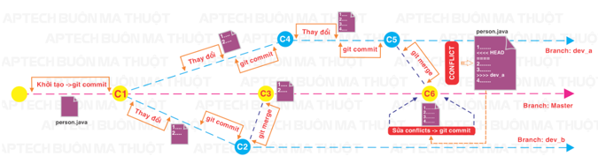
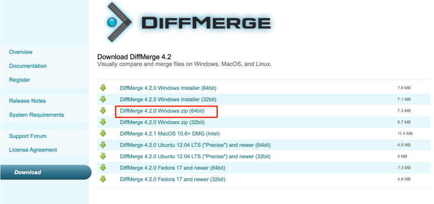
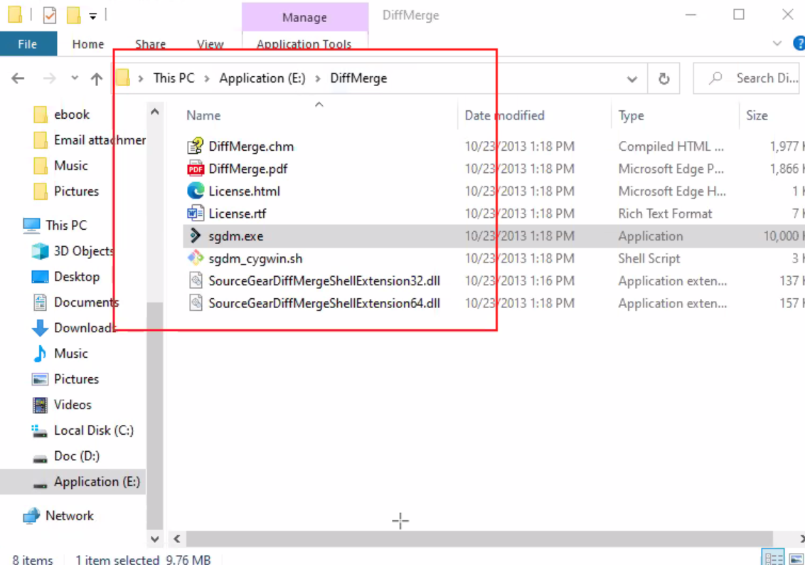
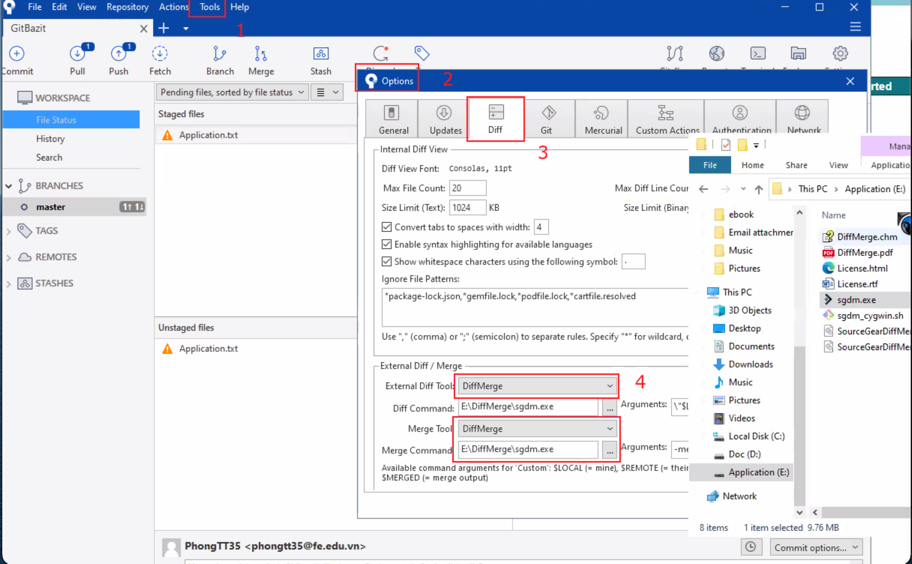
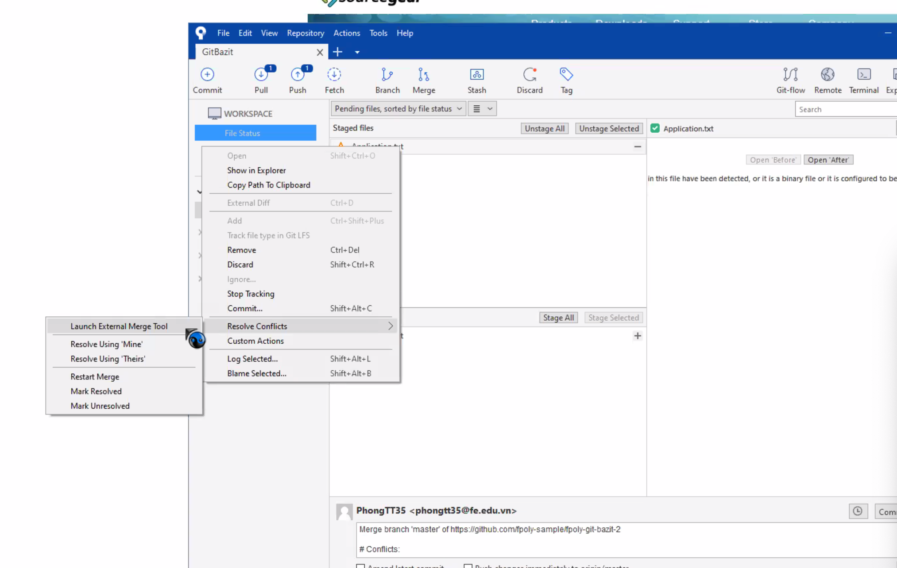
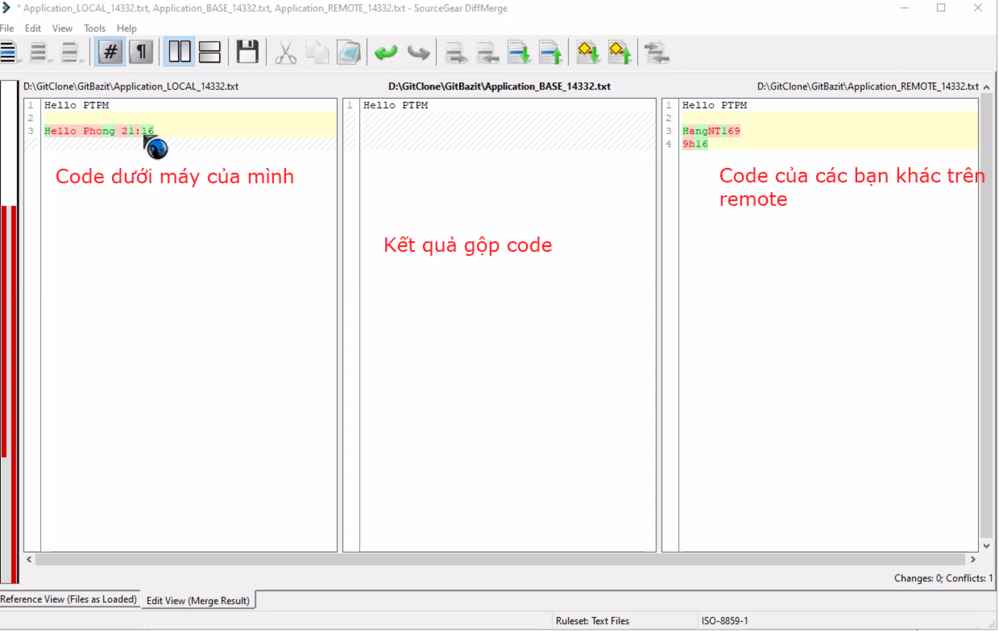
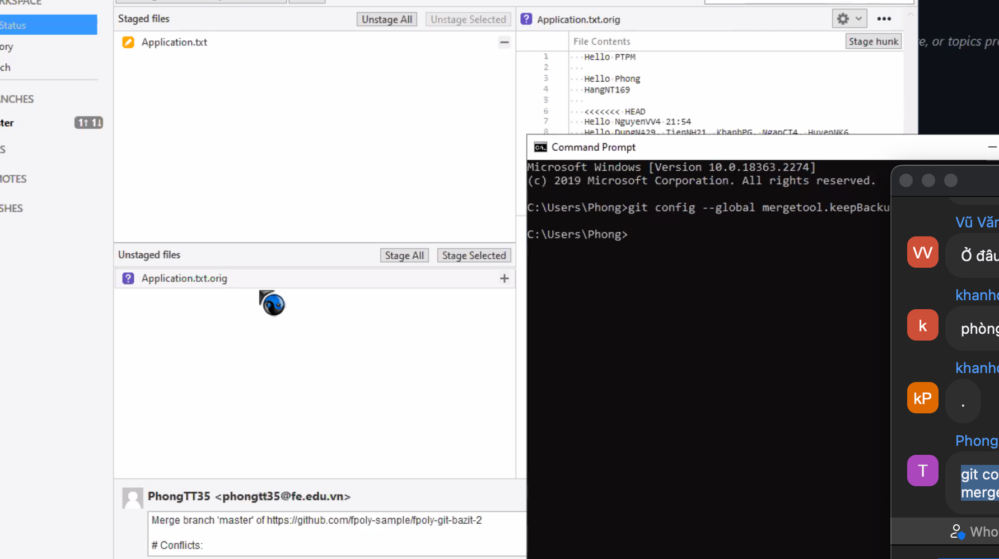
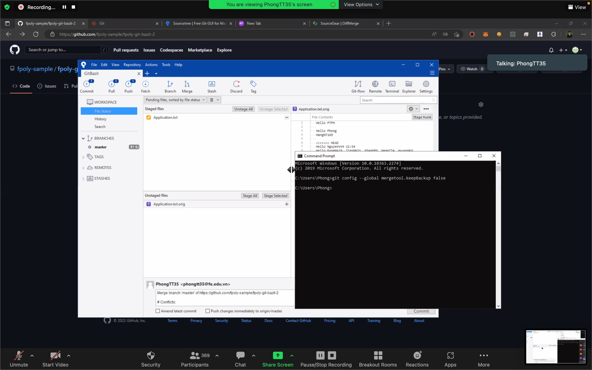
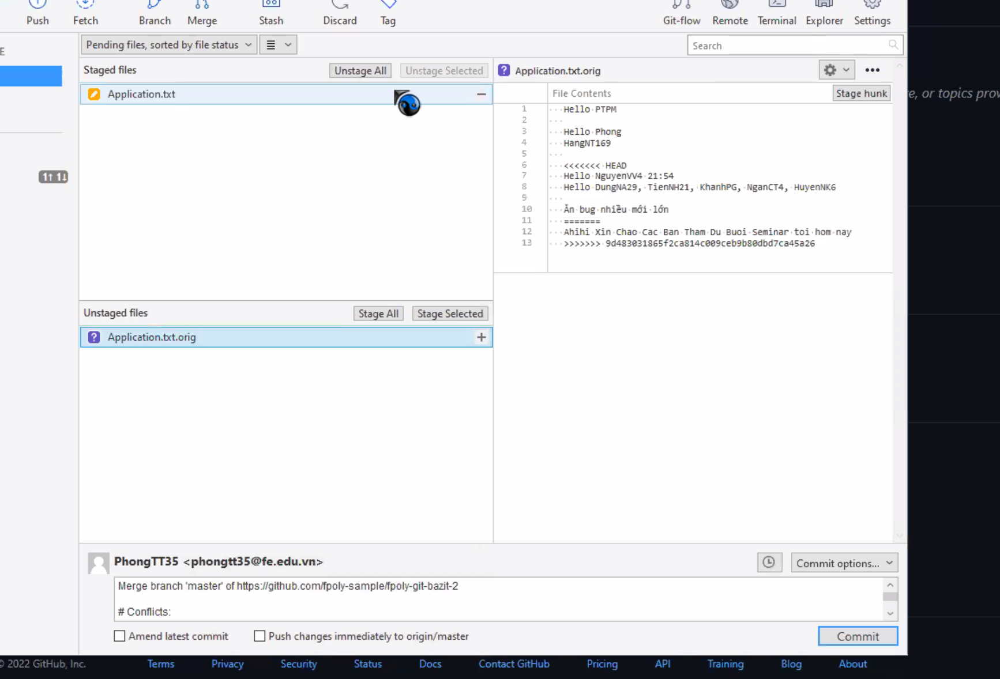

# Hướng dẫn xử lý conflig khi làm việc với git 

# 1. Conflig là gì ?
Git là công cụ làm việc nhóm hiệu quả, nó kiểm soát và quản lý rất tốt các đóng góp cho nội dung dự án giữa nhiều tác giả 
(thường là nhà phát triển). Đôi khi nhiều nhà phát triển có thể cố gắng chỉnh sửa cùng một nội dung. 
Nếu nhà phát triển A cố gắng chỉnh sửa mã mà Nhà phát triển B đang chỉnh sửa thì có thể xảy ra xung đột conflict.
Trong bài này, chúng ta sẽ cùng tìm hiểu khái niệm conflict trong git và học cách giải quyết conflict 
khi thực hiện hợp nhất merge đơn giản nhất.
 
 
Như đã nói ở trên, conflict nghĩa là xung đột. Trong một hệ thống kiểm soát nguồn như Git,
xung đột có thể xảy ra khi hai hoặc nhiều người thay đổi cùng một tệp. Các xung đột có thể 
xuất hiện tại kho lưu trữ cục bộ của thành viên hoặc kho lưu trữ từ xa Github.
Ví dụ dưới đây cho thấy xung đột có thể xảy ra khi 2 branch dev_a và dev_b
cùng làm việc trong một dự án. Xung đột xảy ra khi dev_a và dev_b cố gắng 
merge mã mới vào master mà không cập nhật các thay đổi từ nhau.
 
 
 
Ở biểu đồ trên, 2 nhánh dev_a và dev_b cùng thao tác trên một file là person.java.
- Đầu tiên dev_b thay đổi nội dung tại các dòng 1 và 2 của file person.java và thực hiện commit C2 để ghi lại các thay đổi đó.
- Sau đó dev_b merge các thay đổi này vào nhánh master ở commit C3.
- Song song đó, dev_a cũng thay đổi nội dung tại các dòng 1,2,3 và 4 của file person.java và thực hiện 2 commit là C4 và C5 để ghi lại các thay đổi của mình
- Sau đó, dev_a cũng thực hiện lệnh hợp nhất merge để cập nhật các commit C4 và C5 vào nhánh master như commit C6.
- Lúc này, xung đột conflict sẽ diễn ra. Do Git nhận thấy nội dung trên mỗi dòng của file person.java là không giống nhau tại 2 phiên bản chuẩn bị hợp nhất. Nghĩa là tại thời điểm merge branch dev_a vào master thì nội dung của file person.java trên dev_a có sự không đồng nhất với nội dung trên file person.java của nhánh master (Git so sánh từng dòng trong file, để theo dõi sự thay đổi của file đó). Cụ thể: như biểu đồ trên thì xung đột bắt đầu từ dòng số 2.
 

## =>  Nói tóm lại xảy ra xung đột khi và chỉ khi có ít nhất 2 người cùng động vào cùng 1 file. 

# 2. Giải quyết conflig trong git 
Ở đây, Git sẽ trực tiếp thêm vào một số từ khóa vào trong file person.java (như bên dưới) để nhà phát triển có thể xem xét và quyết định thay đổi của mình.
 

 
Có thể hiểu những dòng mới trong file person.java này là "Conflict deviders" bộ chia xung đột. Trong đó:
+ Đầu tiên, dòng "<<<<<<< HEAD" là nội dung tồn tại trong nhánh master hiện tại mà tham chiếu HEAD đang trỏ tới.
+ Thứ hai, tất cả nội dung phía sau dòng "=======" là "trung tâm" của cuộc xung đột. Thể hiện nội dung xung đột.
+ Thứ ba, tất cả nội dung phía sau dòng ">>>>>>> dev_a" là nội dung có trong nhánh dev_a chuẩn bị hợp nhất vào master.

Như vậy, sau khi đã xác định nội dung xung đột. Cách trực tiếp nhất để giải quyết xung đột hợp nhất là chỉnh sửa tệp bị xung đột. Mở file person.java trong trình soạn thảo yêu thích của bạn. Ví dụ ở đây tôi chỉ cần loại bỏ tất cả các bộ chia xung đột bằng cách xóa nó đi. Nội dung file person.java được sửa đổi sẽ trông như sau:
 

 
Bước tiếp theo là thực hiện git add để tạo nội dung hợp nhất mới và để hoàn tất việc hợp nhất, hay sử dụng git commit để tạo một cam kết mới cho kho lưu trữ.

### Tổng kết:
- Để giải quyết xung đột conflict trong git, rất đơn giản là chỉnh sửa nội dung trên file mà nó dẫn tới xung đột, sau đó thực hiện add, commit cho file đó.
- Để giảm thiểu xung đột trong một nhóm có nhiều thành viên, bạn nên xác định một quy trình ngay từ đầu để tất cả các thành viên trong nhóm làm việc trên cùng một dự án được biết khi sử dụng Git. Dưới đây là một số gợi ý để làm việc hiệu quả hơn:
+ Cam kết thường xuyên: đừng đợi cho đến khi bạn có một lượng lớn các tập lệnh được tạo để commit và push chúng vào kho lưu trữ từ xa Git. Tập lệnh nhỏ hơn được push, bạn càng dễ giải quyết xung đột.
+ Nên pull các thay đổi từ kho lưu trữ từ xa Git trước khi làm việc trên các tập lệnh mới và trước khi commit.
+ Mỗi thành viên nên làm việc trên từng tính năng trong các nhánh riêng biệt tại một thời điểm.

# 3. Hướng dẫn fix conflig trên sourcetree 
## Bước 1: Trên sourcetree các bạn cài thêm difmerge 
Link: https://sourcegear.com/diffmerge/downloads.html
 

 
Các bạn chú ý chọn bản win 64 hoặc 32 bit phụ thuộc vào máy của mình nhé.
 
Sau khi tải thì giải nén chúng ta sẽ được như sau:

## Bước 2: Setup như ảnh dưới đây

## Bước 3: Xảy ra conflig và fix
Khi các bạn cùng nhau sửa trên 1 file => Sẽ xảy ra hiện tượng xung đột code(giải thích kĩ ở phần 1) hay còn gọi là 
 
Dưới đây là ví dụ về các fix conflig:
 

 

## Bước 4: Sau khi fix xong thì các bạn save và tắt dialog đó đi

Khi fix xong nó sẽ sinh ra 1 file .orig để lưu lại quá trình history config gì.
 
Các bạn có thể xoá bằng tay hoặc nếu các bạn không muốn nó sinh ra nữa thì chạy câu lệnh command sau:
 
### git conflig --global mergetool.keepBackup false
 

 

## Bước 5: Commit file vừa fix conflig
Sau khi fix conflig xong thì đây là kết quả :
 
 

